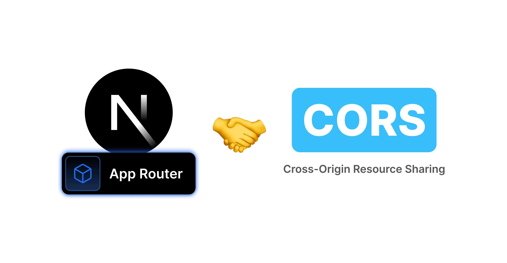

# NextJS13 AppRouter Cors Configuration

A simple example of how to configure CORS in a NextJS 13 app using AppRouter.

---

## Tutorial

This repo is part of tutorial article. You can find the Medium article here: [NextJS 13 AppRouter Tutorial]([TBD](https://codingwithmanny.medium.com/3-ways-to-configure-cors-for-nextjs-13-app-router-api-route-handlers-427e10929818))

[](https://codingwithmanny.medium.com/3-ways-to-configure-cors-for-nextjs-13-app-router-api-route-handlers-427e10929818)


---

## Getting Started

### Prerequisites

- NVM or [NodeJS v18.17.1](https://nodejs.org/en/download/)
- pnpm

### Installation

```bash
#FROM: /

pnpm install
```

### NextJS Server

```bash
#FROM: /

pnpm dev
```

### Client-Side App Server

```bash
#FROM: /

pnpm client
```

---

## CORS Configurations

### Option 1 - NextJS Config

You can find those cors configurations in `next.config.js`.

### Option 2 - Route Handler

You can find those cors configurations in `pages/api/users/route.ts`.

### Option 3 - Middleware CORS Configurations

You can find those cors configurations in `middleware.ts`.

---

built by [@codingwithmanny](https://www.x.com/codingwithmanny)